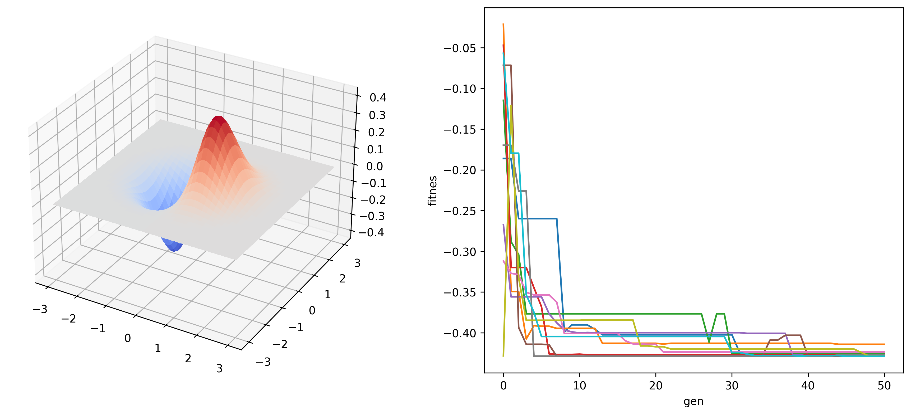

# Real-Valued-Genetic-Algorithm
In this repository it is implemented a real-valued genetic algorithm in python to minimize objective functions. All operators are implemented into a single class  to facilitate the understanding of the algorithm.

## Method description
The implemented algorithm consists of three operators: binary tournament, crossover and mutation. Which imitates the natural selection mechanism.

Given an objective function $f=f(x_1,x_2,\dots,x_n):R^n\rightarrow R$ to be minimized, denominated fitness. The algorithm stars defining a random set of solutions, which evolve through each generation (iteration) of the algorithm. On each generation, the set of solutions are compared on random binary tournaments to identify the most salients. Then, a recombination process (crossover) combine the information of the solutions. Finally, solutions have a little mutation probability to expand the explored information. The next generation is formed with the most salient solution of this process and some the best solution of the current generation.

## Instalation
Clone this repository:
```bash
git clone git@github.com:daniel-lima-lopez/Real-Valued-Genetic-Algorithm.git
```

## Example
Within the same directory, we can import the algorithm as follows:
```python
from GenAlg import RealGA
GA = RealGA(nv=2, f=fitness)
```
where $nv$ is the number of variables in the fitness function $f$.

For example for the function:
$$f(x,y)=x\cdot e^{-(x^2+y^2)} $$
The following code minimize the function considering this as a problem of 2 variables (`nv=2`), a poblation of 10 individuals (`ni=10`), a mutation probability of $10\%$ (`pm=1/10`) and restrinting the varaibles domain in the set $[-5.0,5.0]$:
```python
from GenAlg import RealGA

# fitness function
def f(xs):
    fs = []
    for xi in xs:
        fs.append(xi[0]*np.exp(-(xi[0]**2+xi[1]**2)))
    return fs

# algorithm
GA = RealGA(nv=2, ni=10, f=f, pm=1/10, ri=-5.0, rf=5.0)

# evolution process
bests, best_fs = test.train_estb(gens=50)

```
The console prints the evolution of the algorithm:
```bash
Generacion: 1
Fit promedio : -0.009436005576237246
Fit minimo ([-0.36725049  1.06116519]): -0.10407373725213666

Generacion: 2
Fit promedio : 0.003707735133523954
Fit minimo ([-0.36725049  1.06116519]): -0.10407373725213666
.
.
.
Generacion: 49
Fit promedio : -0.3816207840035485
Fit minimo ([-0.63125048 -0.04682561]): -0.42285652398462925

Generacion: 50
Fit promedio : -0.4187185638687967
Fit minimo ([-0.63125048 -0.04682561]): -0.42285652398462925

```
The next figure shows the fitness function on the left size. On the reight side, it is presented the minimization of the fitness function on 10 diferent experiments.
